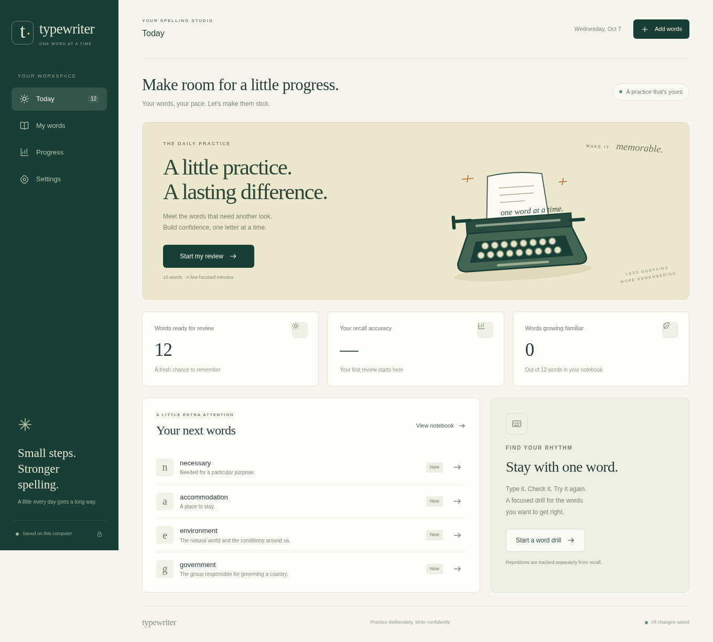

# Typewriter

A personal spelling notebook with focused typing drills and spaced reviews.
Runs locally in your browser; your words and progress live in SQLite on your computer.

Add words from your writing, practise a difficult spelling repeatedly, and come back
for short reviews. Drill repetitions, hints, and correction attempts are kept separate
from unaided recall. Words become confident after successful reviews across different days.



## Run

```bash
python3 -m venv .venv
source .venv/bin/activate
python -m pip install -r requirements.txt
python app.py
```

Open **http://127.0.0.1:8080**. Use `python app.py --port 8081` to change the port.

Python 3.10 or newer is required. On Windows, activate with `.venv\Scripts\activate`.

### Pop!_OS / Linux launcher

After setting up the Python environment, install the application-menu entry:

```bash
python3 desktop/install.py
```

Search for **Typewriter** in your application launcher and open it. It starts the
local server in the background and opens your default browser. Repeated clicks reuse
the running server. If port 8080 is occupied by another app, a nearby free port is used.
No terminal or administrator privileges are needed for normal launching.

Closing the browser tab leaves the server running. The launcher's **Stop Typewriter**
action stops a server it started; you can also run `python3 desktop/launch.py --stop`.
Keep the project folder in place, or rerun the installer after moving it.
Remove `~/.local/share/applications/typewriter.desktop` to remove the menu entry.

## Your notebook

- Add individual words with manual clues, or paste a list of words.
- Look up meanings, exact-word examples, and UK/US audio in Cambridge Dictionary.
- Ask Gemini to fill missing meanings, sentences, and spelling tips in batches.
- Find a drill word in an editable dropdown; matches narrow as you type, with Tab completion.
- Drill for 10, 20, or 50 correct repetitions, or practise without a target.
- Review due words, select a set for extra practice, or choose **Practise endlessly** on Today. Enter checks an answer; a result card stays visible until you press Enter again.
- Choose sentence spelling, spelling from a meaning, audio-only spelling, and meaning quizzes in Settings.
- Listening exercises play automatically; **Alt+P** plays or replays audio inside a session.
- Flag incorrect pronunciation, preview recordings, or upload your own voice in the word editor.
- Flag a wrong meaning during practice, or select existing words and prepare them again.
- See recall accuracy, practice activity, and recurring misspellings.
- Export and import words and history from Settings. Repeated imports don't duplicate attempts.

The optional starter collection includes twelve words and needs no API calls.

Spelling reviews mix the enabled clue types; an exercise only includes words with the
material it needs. Audio-only exercises show no sentence or definition. Meaning quizzes
ask you to choose a definition (click or press **1–4** to answer immediately) and have separate scores;
they do not advance spelling stages. Repeated word drills remain a separate session.

Due spelling words are ordered by recent performance: the last eight unaided reviews,
the latest mistake or use of a hint, and how overdue the word is. New words receive a
middle priority; long-overdue words gradually catch up. Correct unaided reviews move
through 1, 3, 7, 14, and 30-day intervals, with at most one promotion per day. A mistake
or hint brings the word back after ten minutes. Selecting words allows an earlier review.
Quiz questions use their own meaning results to choose words, separately from spelling.

Short reviews use up to **ten due spelling words** by default: a convenient session
length, independent of how words are ranked. Change **Words in a short review** in
Settings to any value from 1–100; selected reviews use the whole selection.
**Practise endlessly** keeps the same exercises and quiz spacing until you press
**Escape** or End session. It starts with due words, then revisits your notebook as
extra practice, choosing another set using your latest performance. **Endless review**
in the selection bar stays within the selected words. Meaning-only sessions can
continue endlessly too. Each answer is saved immediately; ending shows your totals.
Repeated successes still earn at most one spelling-stage promotion per day.

In **Settings → Exercises & sessions → Meaning quiz rhythm**, use the sliders for a
fixed interval (five spelling words by default) or a random inclusive range such as
**2–7**. A new random gap is drawn after each quiz. Spacing applies within each review
session, including across word sets in endless mode; quizzes are extra questions
alongside the chosen number of spelling words. Corrections
don't count as another word, and unanswered skips don't count. If meaning quizzes are
the only available exercise, the session contains quizzes throughout.
Press **Enter** after quiz feedback when you're ready to continue.

Check a pronunciation in the word editor before including it in audio-only exercises.
Existing Cambridge recordings start unchecked. Cambridge lookups only offer audio from
an exact matching headword, avoiding recordings for a base word or redirected typo.
**Wrong pronunciation?** excludes a recording; an uploaded MP3, WAV, OGG, or M4A
(up to 5 MB) replaces it and enables listening practice. If the browser blocks automatic
playback, press **Alt+P** or Listen once to grant a playback gesture.

## Gemini and request limits

Place one API key per line in **`api_keys.txt`**, or paste keys in Settings.
Environment variables `GEMINI_API_KEYS` (comma-separated) and `GEMINI_API_KEY` are also
supported and take precedence over the file. Keys stay on the Python server.

Automatic preparation waits for five pending words by default, then sends up to five
words in each request. Change the batch size, model, daily request budget per key,
and request pacing in Settings. **Prepare now** processes the queue immediately;
select words in My words to prepare just that set. It still respects request budgets.
The default model is `gemini-flash-latest`; you can select a specific Flash version instead.
Model IDs use forms such as [`gemini-3.5-flash`](https://ai.google.dev/gemini-api/docs/models/gemini-3.5-flash).
Common reversed names such as `gemini-flash-3.5` are normalized when saved.
**Refresh model list** loads available text models through your configured connection.
Before generation, the app checks model metadata and caches successful checks per key
for a day. An unavailable model does not consume a local generation-request budget.
Model discovery and validation are metadata requests, not text-generation requests.

Results are saved locally. Ordinary preparation preserves existing text; flagged meanings
can be corrected on an explicit retry. Unsuitable sentences are rejected. Sources are shown in the word editor; suggestions remain editable.
Failures and partial results remain visible after refreshing or restarting. Failed words
stay queued for a manual retry. A failure popup offers **Use another LLM**, switching to
prompt export/import for the unfinished words while preserving your connection settings.
Temporary server errors receive up to two retries,
with backoff and the same request budgets; retries also count as requests.
A generation request waits up to two minutes for a response, allowing slower thinking
models to finish; the batch status stays visible while it runs.
Settings → Application log shows recent results, HTTP statuses, and connection errors.
Download the log when troubleshooting; raw responses and credentials are never logged.

Keys rotate between requests and when a provider limit or rejected key is encountered.
Usage and cooldowns survive restarts. Daily counters reset at midnight Pacific time.
[Gemini quotas apply per Google project](https://ai.google.dev/gemini-api/docs/rate-limits),
so keys from the same project don't provide independent limits. The local request budget
is a configurable ceiling, not a measurement of your provider's remaining token quota.

## Prepare with any LLM, without an API

Choose **Settings → Word preparation → Preparation method → Another LLM** and save.
This disables Gemini generation, including automatic batches. Choose **Add material by
hand** for manual entry instead. Both options work without API keys.

1. Open **Prepare with another LLM** in My words, or the export/import tool in Settings.
2. Choose the queue or selected words and **1–100 words per file**. Download the ZIP.
   To revisit prepared words, select them in My words and choose **Prepare again**, or
   enable **Re-evaluate existing material** in the export dialog.
3. Give one Markdown prompt at a time to your chosen LLM. Each includes instructions,
   vocabulary, a unique batch ID, and the exact JSON output contract.
4. Paste the reply or open its `.json`, `.md`, or `.txt` file. Preview it, then apply it.

The app also accepts a Markdown reply containing one fenced JSON block. Import validates
all entries before changing anything, rejects unexpected/duplicate words and unsuitable
sentences, and fills empty fields while keeping your edits. Partial replies leave omitted
words queued; repeated imports do not overwrite prepared words. Flagged meaning imports
replace the definition and quiz options while preserving other saved material. Explicit
re-evaluation replaces meanings, sentences, tips, and quiz options after preview. Replies
exported before a newer edit or flag change are skipped. Keep the same notebook
(database) for export and import: it records which words belong to each batch.

**Wrong meaning?** during practice queues that word for correction and excludes its
definition from meaning quizzes and definition clues. Flagging before answering lets you
skip the question without recording an attempt. Fix it with **Prepare now**, an exported
prompt, or a manual definition edit; the word editor also lets you clear the flag. Flagged
meanings wait for an explicit request rather than triggering automatic API batches.

Gemini and exported prompts request three plausible, clearly incorrect meanings matched
to each word's intended sense. Quizzes use these generated options when available; older
words use other unflagged notebook meanings until prepared again. Preview the options
before importing; LLM suggestions still need checking.

The exported prompts contain your chosen vocabulary and clues. They contain no API keys,
proxy settings, or practice history. Export and import make no external requests.

## Proxy

In **Settings → Proxy**, enable HTTP or SOCKS5, enter the host and port, and optionally
set a username and password. The editable preset is `127.0.0.1:10808`; a fresh install
starts with the proxy disabled. SOCKS5 uses proxy-side DNS resolution.

All app requests to Gemini and Cambridge, including pronunciation downloads, use this
route. The app never falls back to direct networking when an enabled proxy fails.
Disabling the proxy means a direct connection, regardless of shell proxy variables.
Use **Save & test connection** to check the route; this checks connectivity, not API quotas.

## Local data

Your notebook, settings, request counters, preparation results, the latest 500 log events,
and cached audio are in **`data/`**. Logs live in SQLite alongside the notebook.
API keys, proxy credentials, backups, and personal data are excluded from Git.
Backups contain words, attempts, pronunciation and meaning flags, and generated quiz
options, but no keys or connection settings.
Uploaded recordings are not embedded in JSON backups. Copy the entire `data/` directory
when moving your notebook and its recordings together.
Imported Cambridge recordings need checking again before audio-only practice.
The server binds to localhost and uses same-origin request checks. This is a personal
local app; internet hosting and multi-user accounts are outside its current scope.

Dictionary parsing draws on [AnkiAutomata](https://github.com/SMani24/AnkiAutomata).
Typewriter runs independently of Anki. Dictionary lookups depend on Cambridge's site
structure and availability; manual entry and Gemini remain alternatives.

## Checks

```bash
python -m unittest discover -s tests -v
```

Optional browser checks use a temporary notebook and never call Gemini or Cambridge:

```bash
npm install
npx playwright install chromium
npm test
```

Node is needed only for these browser checks. The app itself runs with Python.
